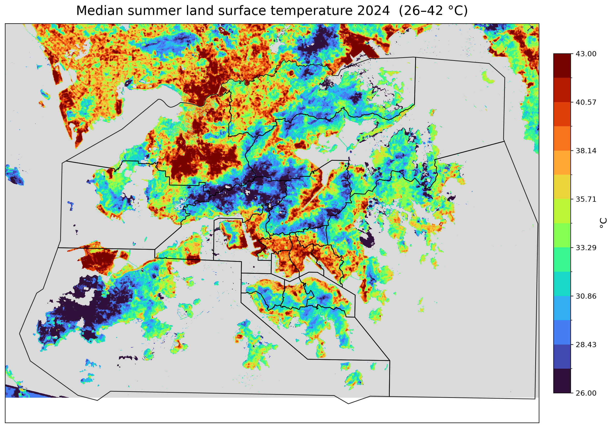
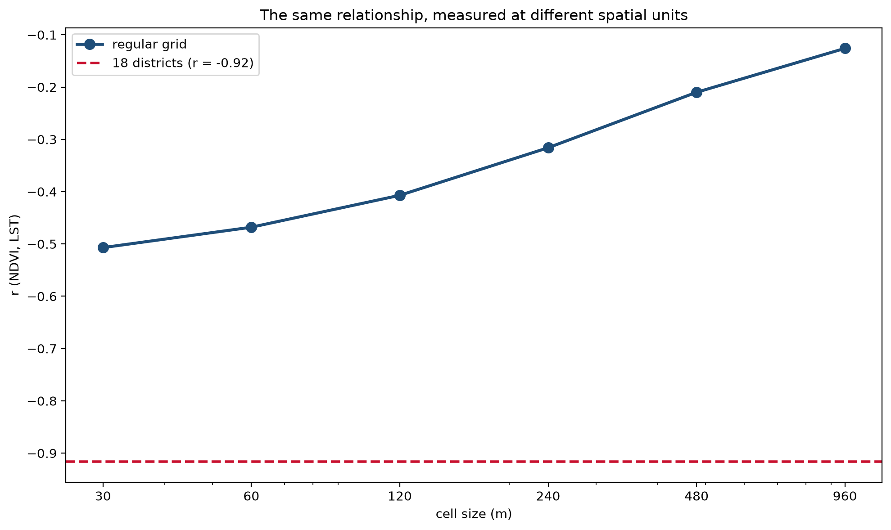
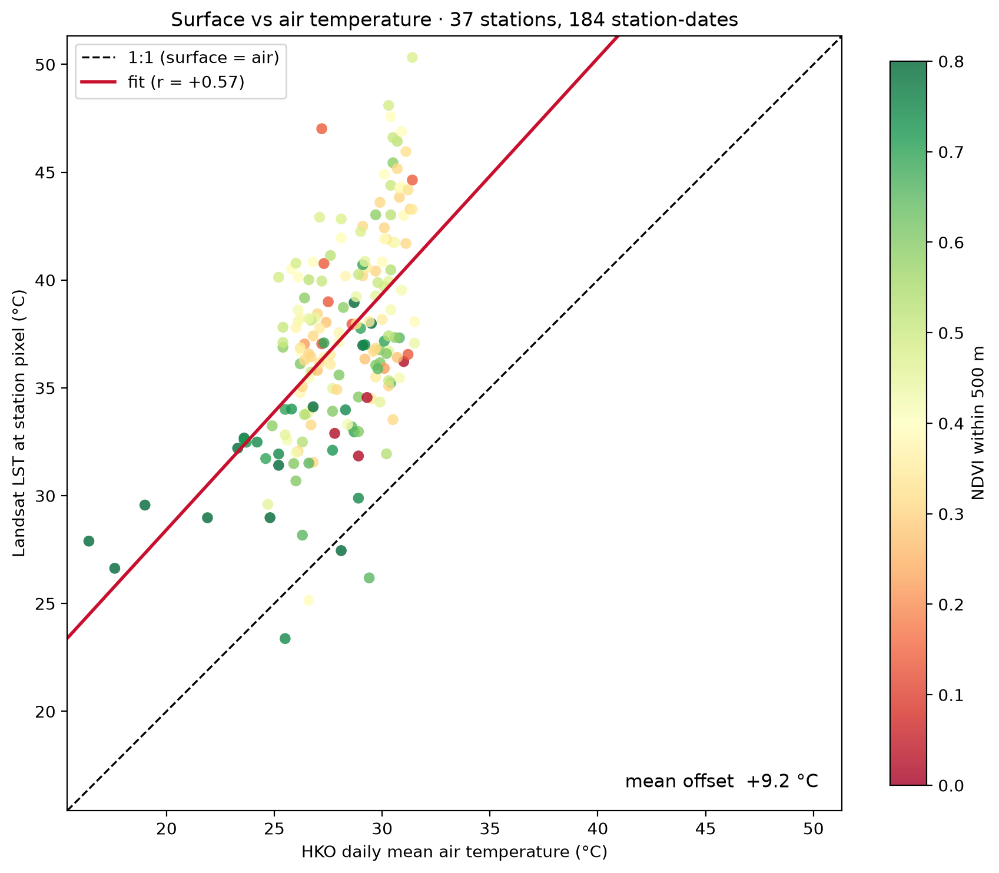

# Hong Kong Urban Heat
### What land surface temperature does and doesn't measure

**George Mills · 2026**

Satellite land surface temperature (LST) is the default evidence base for urban
heat studies. It is global, free and gives millions of observations per city, but
it measures the radiating skin of the ground, while heat exposure, comfort and
mortality track **air temperature**.

This project maps Hong Kong's summer surface heat conventionally, from 1.7 million
Landsat pixels, and then tests what those patterns mean against 38 Hong Kong
Observatory weather stations. The main result is that many "facts" about Hong
Kong's urban heat turn out to be properties of how the data was divided —
which subset, which spatial unit — rather than properties of the city.



## Key findings

**The same relationship can be reported as almost anything.** The correlation
between vegetation (NDVI) and surface temperature is −0.51 at 30 m, −0.13 at
960 m, and −0.92 across the 18 administrative districts. Same data, same season.
Shifting the grid origin barely matters (spread 0.018); the size and shape of the
units matter enormously.



**The headline correlation is a between-group effect.** Territory-wide, NDVI and
LST correlate at −0.51. Inside the built-up area it is +0.02. The 5.6 °C
urban–rural gap is real, but it doesn't mean greening a given street cools it.
Meanwhile the spread *within* built-up land (IQR 4.7 °C) is nearly as large as
the urban–rural gap itself.

**Surfaces are not air.** At the 10:30 overpass, LST runs about 9 °C above
daily mean air temperature, and the gap varies from 4 to 16 °C between stations.
LST and air temperature agree on station rankings only moderately
(Spearman ρ = 0.54), so LST explains under a third of how places rank by air
temperature.



**LST implies an impossible lapse rate.** Surface temperature falls with
elevation at −2.10 °C/100 m, more than twice even the dry adiabatic rate. The
station thermometers measure −0.72 °C/100 m, close to textbook. The "elevation"
signal in LST is largely land cover: Hong Kong's high ground is forest.

**The station network cannot calibrate the satellite.** Stations sit in the
middle of the NDVI range, away from the dense fabric and closed canopy where
surface and air temperature are expected to diverge most.

**Within the urban fabric, the usual predictors explain 4%.** NDVI, elevation,
albedo and distance to the coast together give R² = 0.042 at 480 m, with
residuals almost as spatially clustered as the raw data (Moran's I = 0.68).

**Albedo behaves backwards.** Brighter urban surfaces are *hotter*
(r = +0.49). Four artefact explanations were tested and eliminated and one was
inconclusive. The working hypothesis is that brightness and heat share an axis of
urban form: exposed low-rise industrial roofs are bright and hot, while shaded
high-rise fabric is dark and reads cooler in the morning.

The full argument, with all ten findings, is in the notebook.

## What LST is good for

It is the right instrument for surfaces (cool roofs, pavements, material
retrofits), and nothing else gives continuous 30 m thermal coverage. It is not
sufficient on its own for human heat exposure or for ranking districts by health
risk, and any LST result should state the spatial unit it was computed on.

## Data

| | source | resolution |
|---|---|---|
| Land surface temperature, NDVI, NDBI, albedo | Landsat 8/9 Collection 2 Level-2, 22 scenes, May–Oct 2024, via Microsoft Planetary Computer | 30 m |
| Elevation | Copernicus DEM GLO-30, via Planetary Computer | 30 m |
| Air temperature | Hong Kong Observatory Open Data API (`CLMTEMP`, `CLMMAXT`), 38 stations | daily, point |
| District boundaries | Hong Kong SAR (`hksarboundaries.json`) | vector |

Satellite and station data are fetched by the notebook at run time; nothing large
is stored in this repo.

## Running it

```bash
pip install -r requirements.txt
jupyter lab HONGKONGuhfinalGM.ipynb
```

- Place `hksarboundaries.json` in the same folder as the notebook.
- Outputs are written to `~/Documents/hong-kong-urban-heat/` (`figures/`,
  `results/`, `data/`). Change `PROJECT_DIR` in the setup cell to use another
  location.
- The median composites stream about 22 Landsat scenes and take several minutes;
  the station download makes 76 API calls.

## Methods notes

- Spectral indices and albedo are computed per scene, then composited by median,
  avoiding the median-of-ratios bias.
- Cloud, cirrus, shadow and water are masked from the QA_PIXEL band. Per-date
  station LST needed an extra physical filter (20–60 °C) because undetected cloud
  reads as extremely cold.
- All rasters are forced onto one 30 m UTM 50N grid, with alignment asserted.
- Spatial autocorrelation is quantified (Moran's I, KNN k = 8), so correlations
  and OLS coefficients are reported descriptively rather than inferentially.

## Limitations

Surface temperature is not air temperature; one season of one year; heavy
summer cloud leaves 184 usable station-dates; 38 stations cannot support a
land-cover contrast; a spatial lag or error model would be needed for formal
inference.

## References

- Liang, S. (2001). Narrowband to broadband conversions of land surface albedo I: Algorithms. *Remote Sensing of Environment*, 76(2), 213–238.
- Openshaw, S. (1984). *The Modifiable Areal Unit Problem*. CATMOG 38, Geo Books.
- Robinson, W. S. (1950). Ecological correlations and the behavior of individuals. *American Sociological Review*, 15(3), 351–357.
- Ng, E. et al. Urban Climatic Map and Standards for Wind Environment — Feasibility Study. Planning Department, HKSAR.
